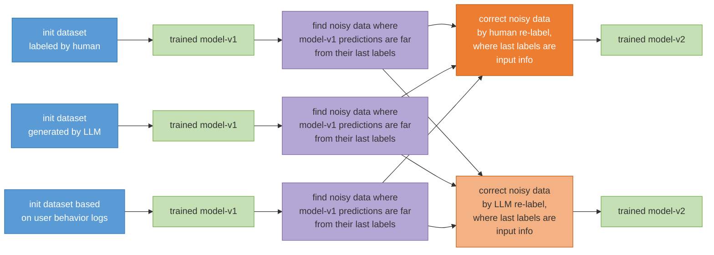

# A Unified Framework for LLM-based ReLabel Method

### Abstract
In industry deep learning application, we need to train and deploy a small model for a specific task. Our dataset for the small model has a certain number of noisy data. The init datasets are from human labeling or LLM (large language model) generation or user behavior log.
To achieve over 90% accuracy on the dev and test datasets, we propose a framework that identifies noisy and badcase data, relabels it using a LLM, and constrains the relabeling task to a binary classification problem. Our conclusion is that the method of using a large model to re-label noisy data is not very effective. This noisy data was identified by finding instances where the predictions of our small model and a large model either disagreed or had a large divergence. While it has been conclusively verified that manual re-labeling improves performance, re-labeling by the large model does not. For the overall workflow — which involves writing prompts for a large model to label data, then training and deploying a small model for a specific task — the best approach we've found so far is to refine the prompts based on badcases from the test dataset.


### 1. Introduction

In recent years, deep learning \cite{ref1} and LLM \cite{ref2,ref3,ref4,ref5,ref7,ref8,ref9,ref10} have shown significant improvement on natural language processing(NLP),
computer vision and speech processing technologies. However, the model performance is limited by the dataset quality.
The main reason is that the dataset has a certain number of noisy and badcase data.
In this paper, we present a unified relabeling framework for NLP tasks. In this paper, 'NLP' refers to a specific NLP task, such as NER, text classification, specific text generation, etc.. Specifically, we define 'NLP tasks' as those that can be solved by the 'data-cover' paradigm. 'LLM tasks', on the other hand, refer to the paradigm that relies on trillion-token pre-training and million-token post-training data.

We study two relabeling targets. The first is instance-level relabeling: we identify noisy and badcase data and correct their labels with a human annotator or an LLM (Fig. 1). The second is prompt-level relabeling: instead of correcting training labels, we iteratively refine the LLM annotation prompt using badcases from a human-annotated test set, then use the refined prompt to label data for the small model. Our idea can apply to a broad set of deep learning industry applications.


### 2. Method



*Fig. 1. Instance-level relabeling framework. After training model-v1 on the initial dataset, we find noisy data where model-v1 predictions diverge from the original labels, and correct them by human or LLM re-labeling.*

#### 2.1 Initial Datasets

Our initial datasets can be sourced from the following three methods:

1) Manual Annotation: Data noise in a manually annotated dataset, using a classification task as an example, occurs when there is disagreement among annotators. For instance, for 3 very similar data to-label, 2 annotators assign label-A, while 1 annotator assigns label-B.

2) LLM Generation: For datasets generated by LLM, data noise in a classification task often stems from overlapping or repetitive definitions for labels within the prompts. **Before generating an initial training dataset using an LLM, it is crucial to first prepare a human-annotated, real-world test dataset. This test dataset should then be used to debug and refine the prompts, ensuring they are fully optimized to maximize the overall quality of the LLM's annotations.** Regarding data generation by LLMs, it is not always necessary to generate from scratch. By collecting logs from actual production use, we can extract a candidate dataset for annotation that is representative of real-world scenarios.

3) User Behavior Logs: Datasets based on user behavior logs are constructed from user actions. For example, in an e-commerce scenario, a dataset can be built based on whether a user clicks on an item or places an order.

#### 2.2 Find Noisy Data And Relabel

```
Algorithm 1. LLM-based Noisy Data Correction To Improve Dev Accuracy

Require: Unlabeled dataset D_raw = {x_i}_{i=1}^{N},
         Initial Prompt P_0, LLM M_LLM, Student Model M_θ, Max Iterations T
Ensure:  Refined Dataset D*, Trained Model M_θ*

1.  // Step 1: Initial Annotation
2.  D_0 ← ∅
3.  for each x_i in D_raw do
4.      y_i^LLM ← M_LLM(x_i, P_0)
5.      D_0 ← D_0 ∪ {(x_i, y_i^LLM)}
6.  end for
7.  // Step 2: Initial Model Training
8.  M_θ ← Train(M_θ, D_0)
9.  t ← 1
10. while t ≤ T do
11.     // Step 3: Hard Example Mining (Self-Prediction)
12.     D_hard ← ∅
13.     for each (x_i, y_i^LLM) in D_{t-1} do
14.         ŷ_i ← M_θ(x_i)                    // Student model prediction
15.         if ŷ_i ≠ y_i^LLM then
16.             D_hard ← D_hard ∪ {(x_i, y_i^LLM)}
17.         end if
18.     end for
19.     if |D_hard| = 0 then
20.         break                             // Convergence reached
21.     end if
22.     // Step 4: Prompt Refinement & Correction
23.     P_t ← RefinePrompt(P_{t-1}, D_hard)   // Generate new prompt based on errors
24.     D_corrected ← ∅
25.     for each (x_i, ·) in D_hard do
26.         y_i^new ← M_LLM(x_i, P_t)         // LLM re-labels hard examples
27.         D_corrected ← D_corrected ∪ {(x_i, y_i^new)}
28.     end for
29.     // Step 5: Dataset Update & Retraining
30.     D_t ← (D_{t-1} \ D_hard) ∪ D_corrected
31.     M_θ ← Train(M_θ, D_t)                 // Retrain student model
32.     t ← t + 1
33. end while
34. return M_θ, D_t
```

In this paper, we define noisy data as ambiguous data; for instance, when three highly similar data are labeled as 'label-A' for two and 'label-B' for the remaining one. We first train a model on the initial dataset. Specifically, we choose the model from the point where the dev loss no longer decreases, using it as our model for self-prediction. Therefore, we use this model to generate predictions for the entire training and dev dataset. The data where the model's prediction differs from the original ground-truth label, or where the prediction error is large, are identified as potential noise/badcases. This method allows us to find approximately 2-10% of the dataset for re-annotation. This approach not only reduces manual annotation costs, but its effectiveness in identifying noisy data has also been validated by our experimental results.

We perform a manual re-annotation of the noisy data. During this process, we provide the human annotators with both the original label and the model's prediction as input information. In the era of LLM, we are now replacing this manual re-annotation with an automated process using an LLM. Similarly, we feed the LLM the same inputs: the original label and the model's prediction. In detail, we ask the LLM within the prompt to correct noisy data made in the last round of labeling. **We require the LLM's error correction output to be chosen from either the result of our trained model or the result from the previous annotation** \cite{ref6}. For example, in a 10-class text classification task, the correction step for the LLM is simplified to a 2-class classification problem, where the candidates are just 2 labels: the previously annotation and the one predicted by the trained model. To be specific, in the prompt we use for LLM annotation during the correction step, we only provide the definitions and examples for the candidate labels, and do not include the definitions and examples for the other labels in the prompt.

#### 2.3 Prompt Relabeling Based on Test Badcases

Instance-level LLM correction is highly dependent on the quality of the initial prompt. We found a more effective alternative: instead of re-labeling the training data of the small model, we re-label the prompt of the large model. Unlike Algorithm 1, which still corrects only the hard subset of training labels, prompt relabeling updates the annotation prompt from test-set badcases and then batch-labels the training set as a whole.

We adopt the idea of the AutoResearch framework for AI-assisted programming. A Code-LLM iteratively improves the annotation prompt from badcases and their error reasons on a human-annotated test set. The procedure is as follows:

1) Prepare a human-annotated, real-world test set. As stated in Section 2.1, this test set should be ready before an LLM is used to generate or label training data.

2) Write an initial prompt P_0 and evaluate the LLM on the test set.

3) Collect badcases together with the corresponding error reasons.

4) Ask a Code-LLM to revise the prompt, yielding P_{t+1}.

5) Repeat until the LLM's test accuracy saturates.

6) Use the refined prompt to batch-label a training set, then train and deploy a small model.

The object of relabeling is therefore the prompt, not the instance labels of the small-model training set.


### 3. Experimental Results

All results below are on a text classification task. Human evaluation presents the model's outputs on real-world data to annotators, who judge each prediction as right or wrong. For instance-level relabeling, labels in the training and development sets may change, while the test set remains unchanged.

#### 3.1 Human Relabeling of Noisy Data

| Dataset | Test-Accuracy |
|---|---|
| Dataset labeled by LLM | 75.0% |
| Human relabeled dataset | 90.0% |

*Table 1. Human relabeling of noisy data whose initial labels come from an LLM. The two datasets correspond to Fig. 1.*

| Dataset | Test-Accuracy |
|---|---|
| Dataset labeled by human | 88.0% |
| Human relabeled dataset | 97.0% |

*Table 2. Human relabeling of noisy data whose initial labels are already human-annotated. The two datasets correspond to Fig. 1.*

Manual re-annotation of the noisy subset identified by our framework substantially improves test accuracy: from 75.0% to 90.0% when the initial labels come from an LLM, and from 88.0% to 97.0% when the initial labels are already human-annotated.

#### 3.2 LLM Relabeling of Noisy Data

| Dataset | Test-Acc |
|---|---|
| Dataset generated by LLM | 74.8% |
| LLM noise-relabeled dataset (loop-1) | 75.3% |
| LLM noise-relabeled dataset (loop-2) | 75.4% |

*Table 3. LLM instance-level relabeling of noisy data. The datasets correspond to Fig. 1.*

Replacing the human annotator with an LLM in the same noise-correction loop yields almost no gain: 74.8% → 75.3% after one loop and 75.4% after two loops. Thus, using a large model to re-label the noisy subset identified by disagreement or large divergence between the small model and the original labels is not effective, even though the same subset is useful when re-labeled by humans.

#### 3.3 Prompt Relabeling via AutoResearch

| Setting | Test-Acc |
|---|---|
| LLM with initial prompt | 73% |
| LLM with AutoResearch-refined prompt | 96% |
| Small model trained on data from initial prompt | 75% |
| Small model trained on data from refined prompt | 86% |

*Table 4. Prompt-level relabeling on a text classification task. Rows 1–2 are the LLM's own test accuracy; rows 3–4 are the small model trained on the corresponding LLM-labeled data.*

We then evaluate prompt-level relabeling on the same type of NLP task. We first use the AutoResearch method to optimize the LLM annotation prompt from test-set badcases. This raises the LLM's own accuracy on the test set from 73% to 96%. We next use the optimized prompt to batch-label a training set. A small model trained on that LLM-labeled data achieves 86% test accuracy. In contrast, a small model trained on data labeled by the initial, manually written prompt (LLM accuracy 73%) achieves only 75%.

#### 3.4 Overall Comparison

| Init-Dataset | Method | Init-Acc | Final-Acc |
|---|---|---|---|
| Human-labeled | Human relabel data | 88.0% | 97.0% |
| LLM-labeled | Human relabel data | 75.0% | 90.0% |
| LLM-labeled | LLM relabel data | 75.0% | 75.0% |
| LLM-labeled | LLM relabel prompt | 75.0% | 86.0% |

*Table 5. Summary of instance-level and prompt-level relabeling. Init-Acc and Final-Acc are the test accuracy of the small model before and after the corresponding relabeling method.*

The four settings are summarized above. Human instance-level relabeling is consistently effective. LLM instance-level relabeling is not. Prompt-level relabeling, i.e., refining the LLM prompt rather than correcting individual training labels, is the best fully automatic approach we have found so far for the workflow of LLM labeling followed by small-model training.


### 4. Discussion

The key advantage of prompt-based data annotation is its efficiency in batch processing. By including a few examples (few-shot learning) in the prompt for a LLM, the LLM can generalize and apply the annotation logic to an entire batch of data. Therefore, LLMs bring the amount of data labeling down to a quantity that is manageable for a single developer. For the relabeling step, the prompt-based LLM can be seen as a batch annotation/correction tool. Humans write few-shot examples into the prompts to correct noise in the training dataset. Although LLMs are considered a tool for batch annotation, we've found in practice that providing a large number of showcases (examples) is not very effective. By examining the LLM's reasoning process, we observed that it can utilize a maximum of 1-5 showcases, even when we provide 20-30.

#### 4.1 Discussion For Dataset Size
Since our noise correction method relies on the statistics of the training data itself, the amount of training data should be in the millions, rather than tens of thousands.

#### 4.2 Discussion For Noisy Data Relabel
We find noisy data by contrasting original labels with model predictions. To correct noisy labels, LLM can be employed to relabel data, thereby reducing the scope of manual annotation. In the LLM relabeling step, our visual inspection reveals that, when correcting noisy data in binary classification tasks, LLMs indeed correctly resolve the majority of ambiguous data. However, as shown in Section 3, this local visual correctness does not translate into a higher test accuracy of the small model. Prompt-level relabeling is more effective: improving the annotation prompt from test-set badcases raises the quality of the entire LLM-labeled training set, rather than only the noisy subset.

#### 4.3 Other Discussion
Why not convert all data annotations into a binary classification task for a second round of relabeling? The proposed method was:

For data where the LLM and our trained small model agreed, the candidate labels would be the LLM's label and the small model's second-best prediction.
For data where they disagreed, the candidates would be the LLM's label and the small model's label.

We experimented with this approach but found that for some simple samples, this relabeling annotation process actually reduced the accuracy of the resulting labels. Ultimately, we decided against implementing this comprehensive binary re-annotation across the entire dataset.

### 5. Conclusion

In the era of LLM, our goal is to train small models for specific NLP tasks. The initial datasets—whether from human labeling, LLM generation, or user behavior logs—contain noisy and badcase data. We proposed a unified relabeling framework with two targets: instance labels and the LLM prompt. The framework supports both a human-in-the-loop (HITL) and an LLM-in-the-loop (LITL) approach.

Experimental results show that human re-labeling of the noisy subset identified by our framework is effective, whereas LLM re-labeling of the same subset is not. For the overall workflow of writing prompts for a large model to label data, then training and deploying a small model, the best approach we have found so far is to iteratively refine the prompts from test-set badcases, rather than to correct individual training labels with an LLM. Our idea can apply to a broad set of deep learning industry applications.


### Reference
```
\bibitem{ref1}
Krizhevsky A, Sutskever I, Hinton G E. Imagenet classification with deep convolutional neural networks[J]. Advances in neural information processing systems, 2012, 25: 1097-1105.

\bibitem{ref2}
Achiam J, Adler S, Agarwal S, et al. Gpt-4 technical report[J]. arXiv preprint arXiv:2303.08774, 2023.

\bibitem{ref3}
Radford A. Improving language understanding by generative pre-training[J]. 2018.

\bibitem{ref4}
Ouyang L, Wu J, Jiang X, et al. Training language models to follow instructions with human feedback[J]. Advances in neural information processing systems, 2022, 35: 27730-27744.

\bibitem{ref5}
Raffel C, Shazeer N, Roberts A, et al. Exploring the limits of transfer learning with a unified text-to-text transformer[J]. Journal of machine learning research, 2020, 21(140): 1-67.

\bibitem{ref6}
Tong Guo. Automatic Label Error Correction. TechRxiv. March 12, 2025.

\bibitem{ref7}
Yang A, Li A, Yang B, et al. Qwen3 technical report[J]. arXiv preprint arXiv:2505.09388, 2025.

\bibitem{ref8}
Liu A, Feng B, Xue B, et al. Deepseek-v3 technical report[J]. arXiv preprint arXiv:2412.19437, 2024.

\bibitem{ref9}
Guo D, Yang D, Zhang H, et al. DeepSeek-R1 incentivizes reasoning in LLMs through reinforcement learning[J]. Nature, 2025, 645(8081): 633-638.

\bibitem{ref10}
Shao Z, Wang P, Zhu Q, et al. Deepseekmath: Pushing the limits of mathematical reasoning in open language models[J]. arXiv preprint arXiv:2402.03300, 2024.
```
