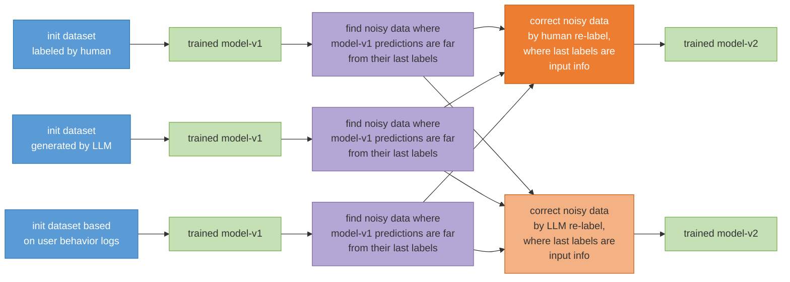
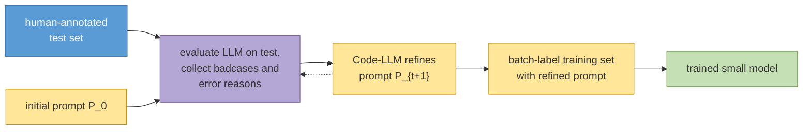
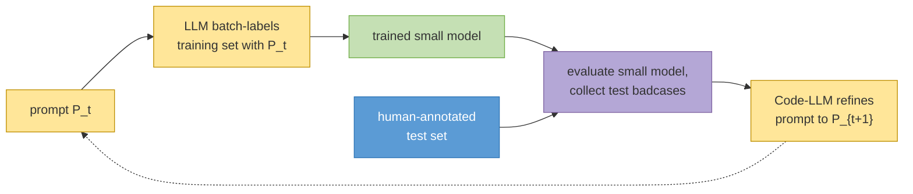

# A Unified Framework for LLM-based ReLabel Method

### Abstract
In industry deep learning application, we need to train and deploy a small model for a specific task. Our dataset for the small model has a certain number of noisy data. The init datasets are from human labeling or LLM (large language model) generation or user behavior log. To achieve over 90% accuracy on the dev and test datasets, we propose a framework that identifies noisy and badcase data, relabels it using a LLM, and constrains the relabeling task to a binary classification problem. Our conclusion is that the method of using a large model to re-label noisy data is not very effective. This noisy data was identified by finding instances where the predictions of our small model and a large model either disagreed or had a large divergence. While it has been conclusively verified that manual re-labeling improves performance, re-labeling by the large model does not. For the overall workflow -- which involves writing prompts for a large model to label data, then training and deploying a small model for a specific task -- the best approach we've found so far is prompt-level relabeling with two loops: an LLM-prompt loop that iterates the prompt from the LLM's test-set badcases, then labels data and trains a small model; and a small-model loop that further iterates from the small model's test-set badcases, re-labels the training set, and retrains. On the fixed test set the small-model loop is higher (92% versus 86%), but human evaluation of the small model's outputs on real-world data does not improve and declines slightly, from 95% for the LLM-prompt loop to 93% for the small-model loop.


### 1. Introduction

In recent years, deep learning \cite{ref1} and LLM \cite{ref2,ref3,ref4,ref5,ref7,ref8,ref9,ref10} have shown significant improvement on natural language processing(NLP),
computer vision and speech processing technologies. However, the model performance is limited by the dataset quality.
The main reason is that the dataset has a certain number of noisy and badcase data.
In this paper, we present a unified relabeling framework for NLP tasks. In this paper, 'NLP' refers to a specific NLP task, such as NER, text classification, specific text generation, etc.. Specifically, we define 'NLP tasks' as those that can be solved by the 'data-cover' paradigm. 'LLM tasks', on the other hand, refer to the paradigm that relies on trillion-token pre-training and million-token post-training data.

We study two relabeling targets. The first is instance-level relabeling (Fig. 1): we identify noisy and badcase data and correct their labels with a human annotator or an LLM. The second is prompt-level relabeling: instead of correcting training labels, we iteratively refine the LLM annotation prompt using badcases from a human-annotated test set, then use the refined prompt to label data for the small model. Prompt-level relabeling has two loops (Fig. 2 and Fig. 3). In the LLM-prompt loop, we iterate the prompt from the LLM's own test-set badcases until LLM accuracy saturates, then batch-label the training set and train the small model. In the small-model loop, we iterate further through the small model: refine the prompt from the small model's test-set badcases, re-label the training set, and retrain. The LLM-prompt loop is related to automatic prompt optimization \cite{ref11,ref12,ref13,ref14}. We differ in that the prompt is an annotation prompt for training a small deployed model, and we further close the loop through the small model's own badcases. Our idea can apply to a broad set of deep learning industry applications.


### 2. Related Work

Our work sits at the intersection of automatic prompt optimization, LLM-based data annotation, and instance-level label correction.

**Automatic prompt optimization.** LLM behavior is highly dependent on the prompt, yet prompts are still largely written by trial and error. Automatic prompt optimization (APO) searches for better instructions without manual trial-and-error. Zhou et al. \cite{ref13} propose APE: an LLM generates candidate instructions, and a score function selects among them. Pryzant et al. \cite{ref11} propose ProTeGi (Prompt Optimization with Textual Gradients). Minibatches of errors are turned into natural-language "gradients" that criticize the current prompt; an LLM then edits the prompt in the opposite semantic direction; beam search with bandit selection retains the best candidates. Wang et al. \cite{ref12} propose PromptAgent, which treats prompt search as planning: it collects error feedback and uses Monte Carlo tree search to refine expert-level prompts. Khattab et al. \cite{ref14} propose DSPy, which compiles declarative LM programs by jointly optimizing instructions and few-shot demonstrations against a metric. The goal of these methods is to raise the LLM's own task accuracy.

Our prompt-level relabeling is related but serves a different workflow. We refine an *annotation* prompt so that an LLM can label training data for a small model that will be deployed. The LLM-prompt loop is close to ProTeGi and PromptAgent: both iterate from LLM errors on a labeled evaluation set. The small-model loop is closer to compiling a prompt against a downstream metric, as in DSPy, but differs in two ways. First, the prompt is scored by the student model's test accuracy rather than by the LLM's accuracy, because the two models do not share the same error distribution. Second, each iteration re-labels the entire training set and retrains the student, rather than only searching over prompt candidates for the LLM itself.

**LLM-based annotation.** Instruction-following LLMs \cite{ref2,ref4} are increasingly used as batch annotators \cite{ref15}. Wang et al. \cite{ref20} show that GPT-3 labels can train downstream models at a fraction of human labeling cost. Viswanathan et al. \cite{ref16} propose Prompt2Model: given a natural-language prompt, an LLM generates or retrieves data, and a small deployable model is fine-tuned on that data. Hsieh et al. \cite{ref17} distill LLM labels and rationales into a smaller student (Distilling Step-by-Step). Our setting is the same industrial workflow of writing a prompt, labeling data with an LLM, and training a small task model. We show that the bottleneck is the prompt, not a second pass of instance-level LLM correction. Unlike Prompt2Model, we iterate the annotation prompt from a human-annotated test set, and further close the loop through the small model's own badcases.

**Instance-level label correction.** A complementary line of work identifies and handles individual noisy labels. Northcutt et al. \cite{ref18} propose Confident Learning, which estimates the joint distribution of noisy and true labels from model predicted probabilities and prunes likely errors. Han et al. \cite{ref19} propose Co-teaching: two networks filter small-loss examples for each other. We previously studied automatic label-error correction \cite{ref6}. We use a similar disagreement signal---student predictions that diverge from the original labels---to select a noisy subset, then attempt correction rather than pruning. In this paper we treat instance-level relabeling and prompt-level relabeling in one framework, and find that LLM correction of that subset is not effective, whereas refining the annotation prompt is.


### 3. Method

#### 3.1 Initial Datasets

Our initial datasets can be sourced from the following three methods:

1) Manual Annotation: Data noise in a manually annotated dataset, using a classification task as an example, occurs when there is disagreement among annotators. For instance, for 3 very similar data to-label, 2 annotators assign label-A, while 1 annotator assigns label-B.

2) LLM Generation: For datasets generated by LLM, data noise in a classification task often stems from overlapping or repetitive definitions for labels within the prompts. **Before generating an initial training dataset using an LLM, it is crucial to first prepare a human-annotated, real-world test dataset. This test dataset should then be used to debug and refine the prompts, ensuring they are fully optimized to maximize the overall quality of the LLM's annotations.** Regarding data generation by LLMs, it is not always necessary to generate from scratch. By collecting logs from actual production use, we can extract a candidate dataset for annotation that is representative of real-world scenarios.

3) User Behavior Logs: Datasets based on user behavior logs are constructed from user actions. For example, in an e-commerce scenario, a dataset can be built based on whether a user clicks on an item or places an order.

#### 3.2 Find Noisy Data And Relabel

In this paper, we define noisy data as ambiguous data; for instance, when three highly similar data are labeled as 'label-A' for two and 'label-B' for the remaining one. We first train a model on the initial dataset. Specifically, we choose the model from the point where the dev loss no longer decreases, using it as our model for self-prediction. Therefore, we use this model to generate predictions for the entire training and dev dataset. The data where the model's prediction differs from the original ground-truth label, or where the prediction error is large, are identified as potential noise/badcases (Fig. 1). This method allows us to find approximately 2-10% of the dataset for re-annotation. This approach not only reduces manual annotation costs, but its effectiveness in identifying noisy data has also been validated by our experimental results.



*Fig. 1. Instance-level relabeling. We identify noisy data where model-v1 diverges from the original labels, then correct them by human or LLM re-labeling.*

```
Algorithm 1. LLM-based Noisy Data Correction

Require: Unlabeled dataset D_raw = {x_i}_{i=1}^{N},
         Initial Prompt P_0, LLM M_LLM, Student Model M_θ, Max Iterations T
Ensure:  Refined Dataset D*, Trained Model M_θ*

1.  // Step 1: Initial Annotation
2.  D_0 ← ∅
3.  for each x_i in D_raw do
4.      y_i^LLM ← M_LLM(x_i, P_0)
5.      D_0 ← D_0 ∪ {(x_i, y_i^LLM)}
6.  end for
7.  // Step 2: Initial Model Training
8.  M_θ ← Train(M_θ, D_0)
9.  t ← 1
10. while t ≤ T do
11.     // Step 3: Hard Example Mining (Self-Prediction)
12.     D_hard ← ∅
13.     for each (x_i, y_i^LLM) in D_{t-1} do
14.         ŷ_i ← M_θ(x_i)                    // Student model prediction
15.         if ŷ_i ≠ y_i^LLM then
16.             D_hard ← D_hard ∪ {(x_i, y_i^LLM)}
17.         end if
18.     end for
19.     if |D_hard| = 0 then
20.         break                             // Convergence reached
21.     end if
22.     // Step 4: Prompt Refinement & Correction
23.     P_t ← RefinePrompt(P_{t-1}, D_hard)   // Generate new prompt based on errors
24.     D_corrected ← ∅
25.     for each (x_i, ·) in D_hard do
26.         y_i^new ← M_LLM(x_i, P_t)         // LLM re-labels hard examples
27.         D_corrected ← D_corrected ∪ {(x_i, y_i^new)}
28.     end for
29.     // Step 5: Dataset Update & Retraining
30.     D_t ← (D_{t-1} \ D_hard) ∪ D_corrected
31.     M_θ ← Train(M_θ, D_t)                 // Retrain student model
32.     t ← t + 1
33. end while
34. return M_θ, D_t
```

We perform a manual re-annotation of the noisy data. During this process, we provide the human annotators with both the original label and the model's prediction as input information. In the era of LLM, we are now replacing this manual re-annotation with an automated process using an LLM. Similarly, we feed the LLM the same inputs: the original label and the model's prediction. In detail, we ask the LLM within the prompt to correct noisy data made in the last round of labeling. **We require the LLM's error correction output to be chosen from either the result of our trained model or the result from the previous annotation** \cite{ref6}. For example, in a 10-class text classification task, the correction step for the LLM is simplified to a 2-class classification problem, where the candidates are just 2 labels: the previously annotation and the one predicted by the trained model. To be specific, in the prompt we use for LLM annotation during the correction step, we only provide the definitions and examples for the candidate labels, and do not include the definitions and examples for the other labels in the prompt.

#### 3.3 Prompt Relabeling via the LLM-Prompt Loop

Instance-level LLM correction is highly dependent on the quality of the initial prompt. We found a more effective alternative: instead of re-labeling the training data of the small model, we re-label the prompt of the large model (Fig. 2). Unlike Algorithm 1, which still corrects only the hard subset of training labels, prompt relabeling updates the annotation prompt from test-set badcases and then batch-labels the training set as a whole.



*Fig. 2. Prompt relabeling via the LLM-prompt loop. A dashed loop refines the prompt from the LLM's own test-set badcases until LLM test accuracy saturates; the converged prompt then batch-labels the training set for the small model.*

We adopt the idea of the AutoResearch framework for AI-assisted programming, and the loop is related to automatic prompt optimization from errors \cite{ref11,ref12}. A Code-LLM iteratively improves the annotation prompt from badcases and their error reasons on a human-annotated test set. The procedure is as follows:

1) Prepare a human-annotated, real-world test set. As stated in Section 3.1, this test set should be ready before an LLM is used to generate or label training data.

2) Write an initial prompt P_0 and evaluate the LLM on the test set.

3) Collect badcases together with the corresponding error reasons.

4) Ask a Code-LLM to revise the prompt, yielding P_{t+1}.

5) Repeat until the LLM's test accuracy saturates.

6) Use the refined prompt to batch-label a training set, then train and deploy a small model.

The object of relabeling is therefore the prompt, not the instance labels of the small-model training set. This procedure is already a loop: evaluate the LLM on the test set, collect badcases, refine the prompt, and repeat until LLM accuracy saturates. After that LLM-prompt loop converges, we batch-label the training set and train the small model.

#### 3.4 Prompt Relabeling via the Small-Model Loop

Section 3.3 already loops, but the loop is confined to the LLM prompt: the small model is trained only after the prompt has converged on LLM test accuracy. The LLM and the small model do not share the same error distribution, so a prompt that raises LLM test accuracy to 96% does not necessarily maximize the small model's test accuracy. We therefore extend the loop through the small model (Fig. 3 and Algorithm 2).

**Prompt relabeling via the small-model loop**



*Fig. 3. Prompt relabeling via the small-model loop. Unlike Fig. 2, whose dashed loop iterates only the LLM prompt, the dashed loop here goes through the small model: the LLM labels the training set, a small model is trained and evaluated on a human-annotated test set, the prompt is refined from the small model's badcases, and the training set is re-labeled. The loop repeats until the small-model test accuracy saturates.*

```
Algorithm 2. Prompt Relabeling via the Small-Model Loop

Require: Unlabeled dataset D_raw, initial prompt P_0, LLM M_LLM,
         student model M_θ, human-annotated test set D_test, max iterations T
Ensure:  Refined prompt P*, trained model M_θ*

1.  D_0 ← batch-label D_raw with M_LLM(·, P_0)
2.  M_θ ← Train(M_θ, D_0)
3.  t ← 1
4.  while t ≤ T do
5.      Evaluate M_θ on D_test; collect small-model badcases D_bad and error reasons
6.      if small-model test accuracy saturates then
7.          break
8.      end if
9.      P_t ← RefinePrompt(P_{t-1}, D_bad)     // Code-LLM revises prompt from SM badcases
10.     D_t ← batch-label D_raw with M_LLM(·, P_t)  // re-label the whole training set
11.     M_θ ← Train(M_θ, D_t)
12.     t ← t + 1
13. end while
14. return M_θ, P_{t-1}
```

The procedure is as follows:

1) Write an initial prompt P_0 and use the LLM to batch-label the training set.

2) Train a small model on that LLM-labeled data.

3) Evaluate the small model on the human-annotated test set and collect its badcases together with error reasons.

4) Ask a Code-LLM to revise the prompt from those small-model badcases, yielding P_{t+1}.

5) Re-label the entire training set with P_{t+1} and retrain the small model.

6) Repeat until the small model's test accuracy saturates.

Unlike Section 3.3, whose loop updates only the prompt from LLM test errors, the loop here is driven by the small model's test errors and re-labels the whole training set at each iteration. Unlike Algorithm 1, each iteration re-labels the whole training set rather than only a noisy subset. This is the main difference from ProTeGi \cite{ref11} and DSPy \cite{ref14}: the search target is the student model's accuracy after full re-labeling, not the LLM's own accuracy after prompt editing.


### 4. Experimental Results

All results below are on a text classification task. Human evaluation presents the model's outputs on real-world data to annotators, who judge each prediction as right or wrong. For instance-level relabeling, labels in the training and development sets may change, while the test set remains unchanged.

#### 4.1 Human Relabeling of Noisy Data

| Dataset | Test-Accuracy |
|---|---|
| Dataset labeled by LLM | 75.0% |
| Human relabeled dataset | 90.0% |

*Table 1. Human relabeling of noisy data whose initial labels come from an LLM. The two datasets correspond to Fig. 1.*

| Dataset | Test-Accuracy |
|---|---|
| Dataset labeled by human | 88.0% |
| Human relabeled dataset | 97.0% |

*Table 2. Human relabeling of noisy data whose initial labels are already human-annotated. The two datasets correspond to Fig. 1.*

Manual re-annotation of the noisy subset identified by our framework substantially improves test accuracy: from 75.0% to 90.0% when the initial labels come from an LLM, and from 88.0% to 97.0% when the initial labels are already human-annotated.

#### 4.2 LLM Relabeling of Noisy Data

| Dataset | Test-Acc |
|---|---|
| Dataset generated by LLM | 74.8% |
| LLM noise-relabeled dataset (loop-1) | 75.3% |
| LLM noise-relabeled dataset (loop-2) | 75.4% |

*Table 3. LLM instance-level relabeling of noisy data. The datasets correspond to Fig. 1.*

Replacing the human annotator with an LLM in the same noise-correction loop yields almost no gain: 74.8% → 75.3% after one loop and 75.4% after two loops. Thus, using a large model to re-label the noisy subset identified by disagreement or large divergence between the small model and the original labels is not effective, even though the same subset is useful when re-labeled by humans. Human evaluation of the resulting small model stays at 80%, the same as the model trained on the initial LLM-labeled data, so the relabeling brings no improvement.

#### 4.3 Prompt Relabeling via the LLM-Prompt Loop

| Setting | Test-Acc |
|---|---|
| LLM with initial prompt | 73% |
| LLM with AutoResearch-refined prompt | 96% |
| Small model trained on data from initial prompt | 75% |
| Small model trained on data from refined prompt | 86% |

*Table 4. Prompt-level relabeling on a text classification task. Rows 1–2 are the LLM's own test accuracy; rows 3–4 are the small model trained on the corresponding LLM-labeled data.*

We then evaluate the LLM-prompt loop on the same type of NLP task. We first iterate the LLM annotation prompt from the LLM's own test-set badcases until LLM test accuracy saturates. This raises the LLM's own accuracy on the test set from 73% to 96%. We next use the converged prompt to batch-label a training set. A small model trained on that LLM-labeled data achieves 86% test accuracy. In contrast, a small model trained on data labeled by the initial, manually written prompt (LLM accuracy 73%) achieves only 75%.

#### 4.4 Prompt Relabeling via the Small-Model Loop

| Setting | Test-Acc | Human-Eval |
|---|---|---|
| Small model trained on data from initial prompt | 75% | 80% |
| Small model after LLM-prompt loop | 86% | 95% |
| Small model after small-model loop | 92% | 93% |

*Table 5. Two prompt-level loops. Test-Acc is the small model's accuracy on the fixed test set. Human-Eval is the accuracy of the small model's outputs on real-world data as judged by human annotators. Row 2 is the LLM-prompt loop of Section 3.3; row 3 is the small-model loop of Section 3.4.*

We next extend the loop through the small model. Starting from the same initial prompt, the LLM labels the training set and a small model is trained (75% test accuracy, 80% human evaluation). We then collect the small model's test-set badcases, refine the LLM prompt, re-label the training set, and retrain the small model, repeating this loop. The small model reaches 92% test accuracy, which is 6 points above the LLM-prompt loop (86%). The gap indicates that a prompt optimized by looping on LLM test accuracy is not the same as a prompt optimized by looping on the downstream small model. Human evaluation does not follow this gain. Annotators judge each prediction on real-world data as right or wrong: the initial prompt scores 80%, the LLM-prompt loop scores 95%, and the small-model loop scores 93%. Although the small-model loop improves the test set, human evaluation does not improve and declines slightly.

#### 4.5 Overall Comparison

| Init-Dataset | Method | Ini-Test-Acc | Final-Test-Acc | Human-Eval |
|---|---|---|---|---|
| Human-labeled | Human relabel data | 88.0% | 97.0% | -- |
| LLM-labeled | Human relabel data | 75.0% | 90.0% | -- |
| LLM-labeled | LLM relabel data | 75.0% | 75.0% | 80.0% |
| LLM-labeled | LLM relabel prompt (LLM loop) | 75.0% | 86.0% | 95.0% |
| LLM-labeled | LLM relabel prompt (SM loop) | 75.0% | 92.0% | 93.0% |

*Table 6. Summary of instance-level and prompt-level relabeling. Init-Acc and Final-Acc are the test accuracy of the small model before and after the corresponding relabeling method. Human-Eval is the accuracy of the small model's outputs on real-world data as judged by human annotators.*

The five settings are summarized above. Human instance-level relabeling is consistently effective. LLM instance-level relabeling is not: human evaluation stays at 80.0%, the same as the small model trained on the initial LLM-labeled data, so there is no improvement. Prompt-level relabeling, i.e., refining the LLM prompt rather than correcting individual training labels, is the best fully automatic family of methods we have found so far. Both prompt methods are loops: the LLM-prompt loop (86.0%) iterates the prompt from the LLM's own test-set badcases; the small-model loop (92.0%) iterates further through the small model's test-set badcases, re-labeling and retraining. Human evaluation separates the two loops from the test-set ranking. The small model trained on the initial prompt scores 80.0%. The LLM-prompt loop reaches 95.0%, and the small-model loop reaches 93.0%. Although the small-model loop improves test accuracy, human evaluation does not improve and declines slightly.


### 5. Discussion

The key advantage of prompt-based data annotation is its efficiency in batch processing. By including a few examples (few-shot learning) in the prompt for a LLM, the LLM can generalize and apply the annotation logic to an entire batch of data. Therefore, LLMs bring the amount of data labeling down to a quantity that is manageable for a single developer. For the relabeling step, the prompt-based LLM can be seen as a batch annotation/correction tool. Humans write few-shot examples into the prompts to correct noise in the training dataset. Although LLMs are considered a tool for batch annotation, we've found in practice that providing a large number of showcases (examples) is not very effective. By examining the LLM's reasoning process, we observed that it can utilize a maximum of 1-5 showcases, even when we provide 20-30.

#### 5.1 Discussion For Noisy Data Relabel
We find noisy data by contrasting original labels with model predictions. To correct noisy labels, LLM can be employed to relabel data, thereby reducing the scope of manual annotation. In the LLM relabeling step, our visual inspection reveals that, when correcting noisy data in binary classification tasks, LLMs indeed correctly resolve the majority of ambiguous data. However, as shown in Section 4, this local visual correctness does not translate into a higher test accuracy of the small model. Prompt-level relabeling is more effective: improving the annotation prompt from test-set badcases raises the quality of the entire LLM-labeled training set, rather than only the noisy subset. Extending that loop through the small model's own test-set badcases raises test accuracy, because the prompt is then optimized for the student rather than for the LLM's own accuracy. This test-set gain does not carry over to human evaluation: the LLM-prompt loop scores 95% and the small-model loop scores 93%. Although the small-model loop improves the fixed test set, human judgment of real-world outputs does not improve and declines slightly.

#### 5.2 Other Discussion
Why not convert all data annotations into a binary classification task for a second round of relabeling? The proposed method was:

For data where the LLM and our trained small model agreed, the candidate labels would be the LLM's label and the small model's second-best prediction.
For data where they disagreed, the candidates would be the LLM's label and the small model's label.

We experimented with this approach but found that for some simple samples, this relabeling annotation process actually reduced the accuracy of the resulting labels. Ultimately, we decided against implementing this comprehensive binary re-annotation across the entire dataset.

### 6. Conclusion

In the era of LLM, our goal is to train small models for specific NLP tasks. The initial datasets—whether from human labeling, LLM generation, or user behavior logs—contain noisy and badcase data. We proposed a unified relabeling framework with two targets: instance labels and the LLM prompt. The framework supports both a human-in-the-loop (HITL) and an LLM-in-the-loop (LITL) approach.

Experimental results show that human re-labeling of the noisy subset identified by our framework is effective, whereas LLM re-labeling of the same subset is not. Human evaluation stays at 80%, the same as the initial LLM-labeled model, so instance-level LLM relabeling brings no improvement. For the overall workflow of writing prompts for a large model to label data, then training and deploying a small model, the best approach we have found so far is prompt-level relabeling. Both variants are loops. The LLM-prompt loop refines the prompt from the LLM's own test-set badcases and then trains the small model, reaching 86% test accuracy and 95% under human evaluation. Extending the loop through the small model's test-set badcases, re-labeling the training set, and retraining reaches 92% test accuracy, but human evaluation declines slightly to 93%. Although the small-model loop improves the test set, human evaluation does not improve and even declines slightly. Our idea can apply to a broad set of deep learning industry applications.


### Reference
```
\bibitem{ref1}
Krizhevsky A, Sutskever I, Hinton G E. Imagenet classification with deep convolutional neural networks[J]. Advances in neural information processing systems, 2012, 25: 1097-1105.

\bibitem{ref2}
Achiam J, Adler S, Agarwal S, et al. Gpt-4 technical report[J]. arXiv preprint arXiv:2303.08774, 2023.

\bibitem{ref3}
Radford A. Improving language understanding by generative pre-training[J]. 2018.

\bibitem{ref4}
Ouyang L, Wu J, Jiang X, et al. Training language models to follow instructions with human feedback[J]. Advances in neural information processing systems, 2022, 35: 27730-27744.

\bibitem{ref5}
Raffel C, Shazeer N, Roberts A, et al. Exploring the limits of transfer learning with a unified text-to-text transformer[J]. Journal of machine learning research, 2020, 21(140): 1-67.

\bibitem{ref6}
Tong Guo. Automatic Label Error Correction. TechRxiv. March 12, 2025.

\bibitem{ref7}
Yang A, Li A, Yang B, et al. Qwen3 technical report[J]. arXiv preprint arXiv:2505.09388, 2025.

\bibitem{ref8}
Liu A, Feng B, Xue B, et al. Deepseek-v3 technical report[J]. arXiv preprint arXiv:2412.19437, 2024.

\bibitem{ref9}
Guo D, Yang D, Zhang H, et al. DeepSeek-R1 incentivizes reasoning in LLMs through reinforcement learning[J]. Nature, 2025, 645(8081): 633-638.

\bibitem{ref10}
Shao Z, Wang P, Zhu Q, et al. Deepseekmath: Pushing the limits of mathematical reasoning in open language models[J]. arXiv preprint arXiv:2402.03300, 2024.

\bibitem{ref11}
Pryzant R, Iter D, Li J, et al. Automatic prompt optimization with ``Gradient Descent'' and beam search[C]//Proceedings of the 2023 Conference on Empirical Methods in Natural Language Processing. 2023: 7957-7968.

\bibitem{ref12}
Wang X, Li C, Wang Z, et al. PromptAgent: Strategic planning with language models enables expert-level prompt optimization[C]//The Twelfth International Conference on Learning Representations. 2024.

\bibitem{ref13}
Zhou Y, Muresanu A I, Han Z, et al. Large language models are human-level prompt engineers[C]//The Eleventh International Conference on Learning Representations. 2023.

\bibitem{ref14}
Khattab O, Singhvi A, Maheshwari P, et al. DSPy: Compiling declarative language model calls into self-improving pipelines[C]//The Twelfth International Conference on Learning Representations. 2024.

\bibitem{ref15}
Tan Z, Li D, Wang S, et al. Large language models for data annotation and synthesis: A survey[C]//Proceedings of the 2024 Conference on Empirical Methods in Natural Language Processing. 2024: 930-957.

\bibitem{ref16}
Viswanathan V, Zhao C, Bertsch A, et al. Prompt2Model: Generating deployable models from natural language instructions[C]//Proceedings of the 2023 Conference on Empirical Methods in Natural Language Processing: System Demonstrations. 2023: 413-421.

\bibitem{ref17}
Hsieh C Y, Li C L, Yeh C K, et al. Distilling step-by-step! Outperforming larger language models with less training data and smaller model sizes[C]//Findings of the Association for Computational Linguistics: ACL 2023. 2023: 8003-8017.

\bibitem{ref18}
Northcutt C, Jiang L, Chuang I. Confident learning: Estimating uncertainty in dataset labels[J]. Journal of Artificial Intelligence Research, 2021, 70: 1373-1411.

\bibitem{ref19}
Han B, Yao Q, Yu X, et al. Co-teaching: Robust training of deep neural networks with extremely noisy labels[C]//Advances in neural information processing systems. 2018, 31.

\bibitem{ref20}
Wang S, Liu Y, Xu Y, et al. Want to reduce labeling cost? GPT-3 can help[C]//Findings of the Association for Computational Linguistics: EMNLP 2021. 2021: 4195-4205.
```
